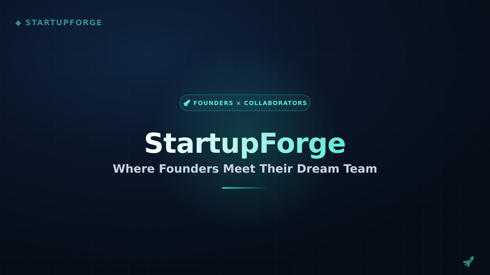

<div align="center">

# 🚀 StartupForge

**The talent marketplace where visionary founders recruit world-class engineers, designers, and growth specialists.**

A full-stack startup-collaboration platform with role-aware dashboards, a gated application pipeline, Stripe-powered subscriptions, and plan-quota enforcement — built on the Next.js App Router.

[](https://nextjs.org)
[](https://react.dev)
[](https://tailwindcss.com)
[](https://better-auth.com)
[](https://stripe.com)
[](https://www.mongodb.com)
[](https://expressjs.com)
[](https://vercel.com)

[](https://startupforgelimited.vercel.app)
[](https://github.com/takebul)

</div>



---

## ✨ Features

**One platform, three personas.** Founders, collaborators, and admins each get a purpose-built workspace. Server-side route guards ([`requireAccountType`](src/lib/core/session.js)) keep every role inside its own dashboard, and the landing banner resolves the viewer's persona before rendering role-specific telemetry.

**Opportunity discovery that behaves like a real product.**
- **Search, filter, sort, paginate** — opportunities filter by work type (Remote / Hybrid / On-site) and industry, sort by deadline or title, and paginate with configurable page sizes. All of it is URL-driven, so filter states are shareable and survive refresh.
- **Gated application flow** — expired deadlines, duplicate applications, unauthenticated visitors, and non-collaborator accounts are rejected before submit. A **100% profile-completeness gate** (name, image, skills, bio) blocks half-baked applications.
- **Bookmarks** with instant local-state updates — optimistic toggling with rollback on failure.

**A founder toolkit with real workflow.**
- Submit a startup (logo via **imgbb upload**) through an **admin approval workflow**: Pending → Approved / Rejected → Resubmitted.
- Post and manage **opportunities** against a plan quota — the form shows a live usage bar and locks with an upgrade CTA once the limit is hit.
- Review **applications** with Accept / Reject decisions, applied optimistically and rolled back if the server call fails.

**Monetization that is actually enforced.**
- **Stripe Checkout subscriptions** with persona-specific pricing — Founder **$29 / $99**, Collaborator **$19 / $49** — a receipt-style success page, and correct current / upgrade / downgrade states.
- **Hard quota gating**: posting and application limits (3 / 10 / 100 per month) are enforced against the user's plan server-side, and Next.js [`proxy`](src/proxy.js) middleware redirects free users away from premium routes like `/profile`.

**An admin console for a running business.**
- **Platform overview** with recharts analytics — monthly/daily revenue growth and user-role distribution.
- **Manage users** — search, filter, and ban/unban (better-auth admin API synced with the database).
- **Manage startups** — approve, reject, resubmit, or permanently delete listings.
- **Transactions** — Stripe receipts with plan mapping, payment-status filtering, and total revenue.

**Engineered, not scaffolded.**
- **Next.js 16 App Router + React 19** — Server Components and Server Actions, **React Compiler** enabled, parallel data fetching (`Promise.all`), streaming `loading.jsx` states, and route groups for `(main)`, `(auth)`, and `dashboard`.
- **better-auth** — email/password + **Google OAuth**, MongoDB adapter, admin **and JWT plugins**, and custom user fields (`accountType`, `plan`, `status`).
- **In-app notifications** — unread count badges, mark single/all read with optimistic UI.
- **Dark mode** out of the box via `next-themes`, HeroUI + Tailwind 4 component layer, Lottie animations, and recharts throughout.
- **Trust & polish** — verified badges, "Own Post" markers on your listings, toast notifications for action feedback, and full **Privacy Policy / Terms of Service** pages with SEO metadata.

---

## 🛠️ Tech Stack

| Category | Stack |
| --- | --- |
| **Framework** | [Next.js 16](https://nextjs.org) (App Router) · [React 19](https://react.dev) · React Compiler |
| **Styling** | [Tailwind CSS 4](https://tailwindcss.com) · [HeroUI](https://heroui.com) · [next-themes](https://github.com/pacocoursey/next-themes) |
| **Motion & icons** | [framer-motion](https://www.framer.com/motion/) / `motion` · [lucide-react](https://lucide.dev) · [@gravity-ui/icons](https://gravity-ui.com) · Lottie (`dotlottie`) |
| **Charts** | [recharts](https://recharts.org) |
| **Auth** | [better-auth](https://better-auth.com) + `@better-auth/mongo-adapter` · Google OAuth · Admin + JWT plugins |
| **Payments** | [Stripe](https://stripe.com) Checkout subscriptions |
| **Data layer** | Server Actions + authed REST fetchers ([`src/lib/core`](src/lib/core), [`src/lib/api`](src/lib/api), [`src/lib/actions`](src/lib/actions)) |
| **Backend API** | [Express 5](https://expressjs.com) · [MongoDB 7](https://www.mongodb.com) driver (separate `startup-forge-server` package) |
| **Tooling** | ESLint 9 · PostCSS · Vercel |

---

## 🚀 Getting Started

The project is a two-package setup: this **Next.js client** and a separate **Express + MongoDB REST API** (`startup-forge-server`).

```bash
# 1. Clone
git clone https://github.com/takebul/startup-forge-client.git
cd startup-forge-client

# 2. Install dependencies
npm install

# 3. Start the backend API (startup-forge-server)
#    cd ../startup-forge-server && npm install && npm start

# 4. Run the development server
npm run dev
```

Open [http://localhost:3000](http://localhost:3000) — the app runs against the backend via `NEXT_PUBLIC_SERVER_URL`.

| Script | Description |
| --- | --- |
| `npm run dev` | Start the development server with HMR |
| `npm run build` | Production build |
| `npm run start` | Serve the production build |
| `npm run lint` | Run ESLint |

> **Note:** Auth, plans, and billing are fully functional locally — create the free account to explore the founder/collaborator dashboards, then head to `/pricing` to walk through the Stripe checkout flow.

---

## 📁 Project Structure

```
startup-forge-client/
├─ src/
│  ├─ app/
│  │  ├─ (main)/                 # Public site — home, startups, opportunities, pricing, privacy, terms
│  │  ├─ (auth)/                 # Sign in / sign up
│  │  ├─ dashboard/              # Role-gated workspaces (founder · collaborator · admin)
│  │  │  ├─ founder/             #   overview, startups, opportunities, applications, profile
│  │  │  ├─ collaborator/        #   browse, applications, bookmarks, profile, premium
│  │  │  └─ admin/               #   overview, users, startups, transactions, profile
│  │  └─ api/                    # better-auth handler + Stripe subscription route
│  ├─ components/                # Navbar, Footer, Banner, HomePage, Opportunities,
│  │                             # Startups, Pricing, Legal, Auth, Dashboard, ApplyModal, Toast
│  ├─ lib/
│  │  ├─ core/                   # Session guards + authed server fetch/mutation helpers
│  │  ├─ api/                    # Client-side fetchers
│  │  ├─ actions/                # Server Actions (mutations to the REST API)
│  │  ├─ auth.js                 # better-auth config (MongoDB, Google, admin + JWT)
│  │  ├─ auth-client.js          # better-auth client hooks (session, admin, JWT)
│  │  └─ stripe.js               # Stripe client + plan → price-id mapping
│  └─ proxy.js                   # Plan-gating middleware (/profile → /pricing)
├─ public/                       # Static assets & screenshot
└─ next.config.mjs               # React Compiler, image remote patterns
```

---

## 🔧 Environment Variables

Create a `.env.local` at the project root (it's gitignored — never commit real values).

| Variable | Purpose | Where to get it |
| --- | --- | --- |
| `BETTER_AUTH_SECRET` | Signs auth sessions | `openssl rand -base64 32` |
| `BETTER_AUTH_URL` | Base URL of this app | `http://localhost:3000` |
| `NEXT_PUBLIC_CLIENT_URL` | Public client origin | `http://localhost:3000` |
| `NEXT_PUBLIC_APP_URL` | Public origin used for SEO metadata (canonical / Open Graph) | `http://localhost:3000` |
| `NEXT_PUBLIC_SERVER_URL` | Backend REST API base URL | your running Express server |
| `MONGODB_URI` | MongoDB connection string | [MongoDB Atlas](https://www.mongodb.com/cloud/atlas) |
| `MONGO_DB_NAME` | Database name | MongoDB Atlas |
| `GOOGLE_CLIENT_ID` | Google OAuth client ID | [Google Cloud Console](https://console.cloud.google.com/apis/credentials) |
| `GOOGLE_CLIENT_SECRET` | Google OAuth client secret | Google Cloud Console |
| `NEXT_PUBLIC_IMGBB_API_KEY` | Logo / image uploads | [imgbb API](https://api.imgbb.com) |
| `NEXT_PUBLIC_STRIPE_PUBLISHABLE_KEY` | Stripe Checkout (client) | [Stripe Dashboard](https://dashboard.stripe.com/apikeys) |
| `STRIPE_SECRET_KEY` | Stripe Checkout (server) | Stripe Dashboard |

The **`startup-forge-server`** package needs its own `.env` with the MongoDB connection details and port — see that package's setup.

---

## 📸 Screenshots


<!--
  Replace with real captures:
  
  
  
-->

---

## 🌐 Live Demo

Try the deployed app — no signup required to browse startups and opportunities:

[](https://startupforgelimited.vercel.app)

---

## 🧑‍💻 Author

**Takebul Islam** — full-stack developer building products that pair clean UX with real business logic.

- 🌐 Portfolio: [takebulislam.vercel.app](https://takebulislam.vercel.app/)
- 💼 LinkedIn: [takebulislam](https://www.linkedin.com/in/takebulislam)
- 🐙 GitHub: [@takebul](https://github.com/takebul)

---

## 📄 License

No license has been selected for this repository yet — `package.json` is marked `private` and no `LICENSE` file is present. If you plan to open-source it, tell me your license (MIT, Apache-2.0, GPL-3.0, …) and I'll drop in the section and badge.

<!--
  Once you pick a license, replace this section with, e.g.:

  ## 📄 License

  Distributed under the **MIT License**. See [LICENSE](./LICENSE) for more information.

  …and add the LICENSE file to the repo root.
-->
