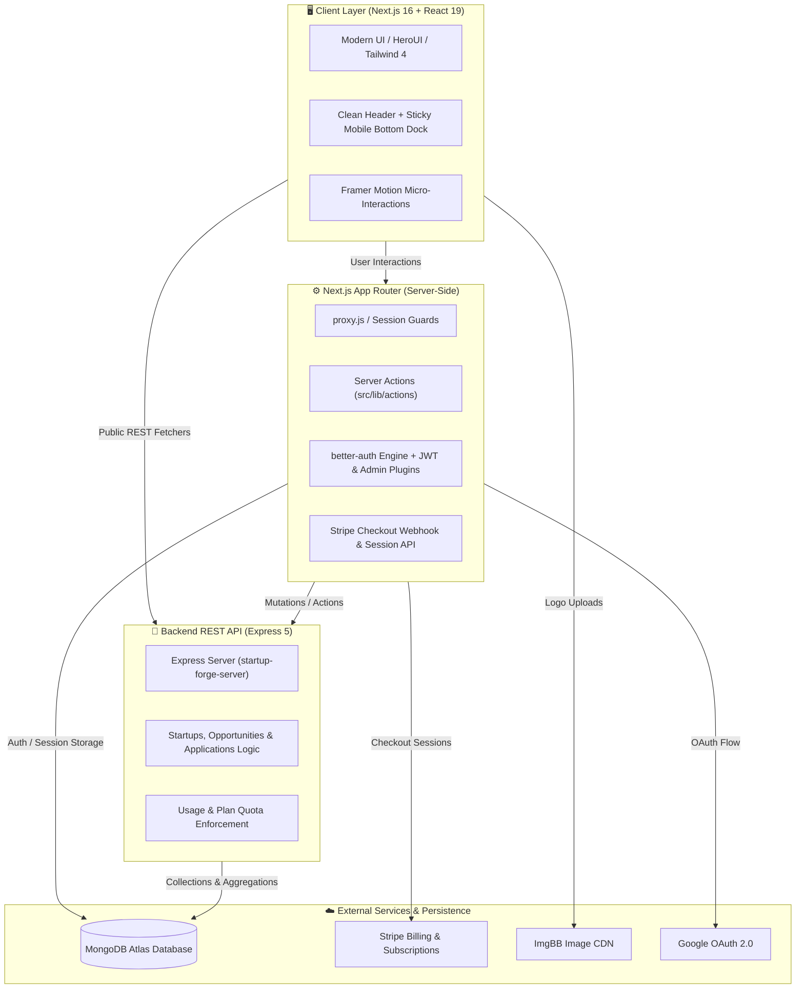

<div align="center">

  <picture>
    <source media="(prefers-color-scheme: dark)" srcset="./public/logo-wordmark-dark.svg#gh-dark-mode-only">
    <source media="(prefers-color-scheme: light)" srcset="./public/logo-wordmark.svg#gh-light-mode-only">
    
  </picture>

  <br />
  <br />

  <p align="center">
    <strong>The next-generation talent & co-founder marketplace where visionary startup founders recruit world-class engineers, designers, and growth leaders.</strong>
  </p>

  <p align="center">
    A production-grade, full-stack platform featuring three-tier role-aware workspaces, an automated candidate vetting pipeline, Stripe-powered monetization with plan-quota enforcement, and an executive administration console — engineered with the Next.js 16 App Router and React 19.
  </p>

  <p align="center">
    <a href="https://startupforgelimited.vercel.app" target="_blank">
      
    </a>
    <a href="https://github.com/takebul" target="_blank">
      
    </a>
    <a href="./LICENSE">
      
    </a>
  </p>

  <p align="center">
    
    
    
    
    
    
    
    
    
  </p>

  <p align="center">
    <a href="#-quick-start">Quick Start</a> •
    <a href="#-core-platform-pillars">Platform Pillars</a> •
    <a href="#-system-architecture">Architecture</a> •
    <a href="#-role-specific-capabilities">Personas</a> •
    <a href="#%EF%B8%8F-tech-stack">Tech Stack</a> •
    <a href="#-environment-variables">Configuration</a> •
    <a href="#-author--acknowledgements">Author</a>
  </p>

</div>

<br />

<p align="center">
  
</p>

---

## 📖 Table of Contents

- [Overview](#-overview)
- [Core Platform Pillars](#-core-platform-pillars)
- [System Architecture](#-system-architecture)
- [Role-Specific Capabilities](#-role-specific-capabilities)
  - [🚀 Founder Portal](#-founder-portal)
  - [💼 Collaborator Workspace](#-collaborator-workspace)
  - [👑 Administrator Control Plane](#-administrator-control-plane)
- [Monetization & Quota Engine](#-monetization--quota-engine)
- [Mobile & Responsive Innovation](#-mobile--responsive-innovation)
- [🛠️ Tech Stack](#%EF%B8%8F-tech-stack)
- [📁 Directory Architecture](#-directory-architecture)
- [🔧 Environment Variables](#-environment-variables)
- [🚀 Quick Start](#-quick-start)
- [🧪 Demonstration & Testing](#-demonstration--testing)
- [📈 SEO, Performance & a11y](#-seo-performance--a11y)
- [📄 License](#-license)
- [🧑‍💻 Author & Acknowledgements](#-author--acknowledgements)

---

## 🌟 Overview

**StartupForge** bridges early-stage startup ventures with top-tier technical and creative professionals. Unlike generic job boards, StartupForge treats startup building as a high-stakes collaboration:

- **Founders** validate their company credentials, post equity/stipend opportunities under plan quotas, and triage applicant pipelines with optimistic states.
- **Collaborators** discover opportunities through URL-driven faceted filters, save listings optimistically, and submit applications gated by a strict **100% profile completeness requirement**.
- **Admins** maintain marketplace integrity through startup verification workflows, user management, and real-time Stripe transaction telemetry.

---

## 💎 Core Platform Pillars

| Pillar | Engineering Highlights | Business Impact |
| :--- | :--- | :--- |
| **🛡️ 3-Tier Route Security** | Server-side role resolution (`requireAccountType`), JWT plugins, and proxy middleware (`src/proxy.js`) protect all routes. | Zero unauthorized data leaks between founder, collaborator, and admin workspaces. |
| **⚡ High-Performance Discovery** | URL-state-driven faceted filtering, sorting, pagination, and React 19 parallel fetching (`Promise.all`). | Instant, shareable, bookmarkable search states that survive page reloads. |
| **📋 Profile Completeness Gate** | Hard pre-application validation requiring photo, bio, skills, and contact data prior to submission. | Founders receive only high-intent, thoroughly documented candidate submissions. |
| **💳 Quota-Enforced Monetization** | Real-time monthly quota meters (3 / 10 / 100) tied directly to Stripe Checkout subscription tiers. | True SaaS recurring revenue model with automatic paywalling upon quota exhaustion. |
| **📱 Native-Feel Mobile Dock** | Adaptive header paired with a sticky bottom navigation dock with Framer Motion tactile feedback. | Effortless one-thumb mobile experience across all consumer and dashboard views. |
| **🌓 Ambient Design System** | Tailored dark/light mode with CSS design tokens, smooth gradients, and glassmorphic surface blur. | Stunning first impression with visual hierarchy and reduced eye strain. |

---

## 🏗️ System Architecture

StartupForge is architected with a modern decoupled stack: a **Next.js 16 App Router frontend** coordinating Server Actions and client interactions, a secure **better-auth engine**, a dedicated **Express 5 API**, and **MongoDB Atlas** persistence.



---

## 🎯 Role-Specific Capabilities

### 🚀 Founder Portal
- **Startup Onboarding**: Submit new venture profiles with high-resolution brand marks uploaded directly via the ImgBB CDN.
- **Admin Verification Pipeline**: Listings transition through `Pending` ➔ `Approved` or `Rejected` with granular feedback and resubmission capabilities.
- **Quota-Gated Opportunity Creator**: Form displays a live capacity progress bar; automatically disables when the monthly allowance is reached with an instant upgrade CTA.
- **Applicant Pipeline Management**: Review submissions with candidate profile previews, resume links, and instant Accept / Reject toggles with optimistic rollback.

### 💼 Collaborator Workspace
- **Smart Opportunity Explorer**: Faceted multi-criteria searching by Work Type (Remote, Hybrid, On-site), Industry, and Role Type with immediate URL synchronization.
- **100% Profile Completeness Gate**: Blocks incomplete profiles from applying, ensuring candidates present complete portfolios and contact methods.
- **Optimistic Bookmarks**: Instant toggling of saved opportunities with background synchronization and fault-tolerant state recovery.
- **Application History**: Track application statuses (`Submitted`, `Under Review`, `Accepted`, `Rejected`) in real time.

### 👑 Administrator Control Plane
- **Platform Analytics**: Visualized revenue growth, conversion metrics, and member role distributions powered by `recharts`.
- **Startup Moderation**: Review submitted companies, inspect pitch decks and team size, and approve or reject submissions.
- **User Governance**: Search and filter platform members; promote roles or invoke instant ban/unban actions via the better-auth admin plugin.
- **Transaction Ledger**: Searchable payment audit logs linked directly to Stripe session IDs, user accounts, and purchased subscription plans.

---

## 💳 Monetization & Quota Engine

StartupForge operates a transparent, tiered subscription model built upon **Stripe Checkout**:

| Plan Tier | Persona | Price | Monthly Quota | Key Entitlements |
| :--- | :--- | :--- | :--- | :--- |
| **Free Starter** | Founder / Collaborator | $0 / mo | 3 items | Basic directory browsing, 3 active opportunities/applications. |
| **Founder Pro** | Founder | $29 / mo | 10 items | Verified founder badge, 10 active opportunities, priority vetting. |
| **Founder Enterprise** | Founder | $99 / mo | 100 items | Unlimited opportunity listings, featured homepage placement, dedicated support. |
| **Collaborator Pro** | Collaborator | $19 / mo | 10 items | Verified member badge, 10 active applications, early opportunity alerts. |
| **Collaborator Elite** | Collaborator | $49 / mo | 100 items | 100 applications, profile spotlight in candidate searches, direct founder intro. |

> [!NOTE]
> All subscription checkouts automatically route to a receipt-style confirmation page with transaction reference IDs, plan badge status, and immediate dashboard redirect.

---

## 📱 Mobile & Responsive Innovation

StartupForge is crafted for mobile-first productivity:

- **Top Minimalist Header**: On small viewports (`< md`), cluttered hamburger dropdowns are eliminated in favor of clean brand presentation, theme switching, and quick auth/profile access.
- **Sticky Bottom Navigation Dock**: A native-inspired bottom tab bar provides immediate one-thumb access to **Home**, **Startups**, **Opportunities**, **Pricing**, and **Dashboard / Sign In**.
- **Tactile Micro-Interactions**: Active navigation indicators feature dynamic sliding pills, scale-down tap animations (`whileTap={{ scale: 0.88 }}`), and hardware-accelerated transitions.
- **Viewport Protection**: Dedicated clearance padding (`pb-16 md:pb-0` on `<main>` and `pb-28 md:pb-14` on `<footer>`) guarantees interactive elements are never obscured by the mobile dock.

---

## 🛠️ Tech Stack

### Core Technologies
```
Frontend:          Next.js 16 (App Router) • React 19 • React Compiler
Styling:           Tailwind CSS 4 • HeroUI v3 • next-themes (Dark / Light)
Motion & Icons:    Framer Motion • Lucide React • Gravity UI Icons • DotLottie
Data Visualization:Recharts
Authentication:    better-auth • MongoDB Adapter • Google OAuth • JWT & Admin Plugins
Payments:          Stripe Checkout API • @stripe/stripe-js
Backend:           Express 5 • MongoDB Node Driver 7 (Native) • CORS
Storage & CDN:     ImgBB REST API
Deployment:        Vercel (Client) • Render / VPS (Backend)
```

---

## 📁 Directory Architecture

```
startup-forge-client/
├── public/                     # Static assets, brand SVGs, PWA manifest, and icons
│   ├── icon.svg                # Vector brand favicon
│   ├── logo-wordmark.svg       # Brand horizontal lockup
│   ├── logo.svg                # 512px vector brand emblem
│   ├── site.webmanifest        # Progressive Web App configuration
│   └── screenshot-placeholder.png
├── scripts/
│   └── generate-favicon.cjs    # Sharp-powered multi-resolution icon generator
├── src/
│   ├── app/                    # Next.js 16 App Router
│   │   ├── (auth)/             # Authentication views (/signin, /signup)
│   │   ├── (main)/             # Public consumer site (/, /startups, /opportunities, /pricing)
│   │   ├── api/                # better-auth route handlers & Stripe webhook proxy
│   │   ├── dashboard/          # Guarded role-based workspaces
│   │   │   ├── admin/          # Overview, user management, startup approvals, transactions
│   │   │   ├── collaborator/   # Discovery, bookmarks, application tracking, profile
│   │   │   └── founder/        # Venture registration, opportunity posting, applicant triage
│   │   ├── globals.css         # Tailwind 4 configuration & custom design tokens
│   │   ├── layout.js           # Root HTML layout, SEO metadata, ambient backgrounds
│   │   ├── loading.jsx         # Global streaming suspense skeleton
│   │   ├── not-found.jsx       # Custom 404 error experience
│   │   └── providers.js        # ThemeProvider & ToastContainer wrapper
│   ├── components/             # Reusable UI component modules
│   │   ├── Auth/               # Sign-in and registration forms with validation
│   │   ├── Dashboard/          # Sidebar, header, telemetry cards, data tables
│   │   ├── Footer/             # Responsive site footer with legal navigation
│   │   ├── Navbar/             # Dual-mode desktop header + sticky mobile bottom dock
│   │   ├── Opportunities/      # Cards, filters, search bars, detail views
│   │   ├── Startups/           # Startup directory grid, detail modal, approval badges
│   │   └── Toast/              # Notification system with auto-dismiss timers
│   ├── lib/
│   │   ├── actions/            # Server actions for mutations & external API calls
│   │   ├── api/                # Client-side authed data fetchers
│   │   ├── core/               # Role validation guards & server-side session utilities
│   │   ├── auth.js             # better-auth server configuration
│   │   ├── auth-client.js      # Client-side auth hooks
│   │   └── stripe.js           # Stripe client initialization & price mapping
│   └── proxy.js                # Plan-gating middleware
├── next.config.mjs             # Next.js configuration (React Compiler, Remote Patterns)
└── package.json                # Project dependencies and operational scripts
```

---

## 🔧 Environment Variables

Configure a `.env.local` file inside `startup-forge-client/`:

```env
# -----------------------------------------------------------------------------
# AUTHENTICATION (better-auth & OAuth)
# -----------------------------------------------------------------------------
BETTER_AUTH_SECRET="your-32-character-random-secret"
BETTER_AUTH_URL="http://localhost:3000"

GOOGLE_CLIENT_ID="your-google-oauth-client-id.apps.googleusercontent.com"
GOOGLE_CLIENT_SECRET="your-google-oauth-client-secret"

# -----------------------------------------------------------------------------
# DATABASE PERSISTENCE (MongoDB Atlas)
# -----------------------------------------------------------------------------
MONGODB_URI="mongodb+srv://<username>:<password>@cluster0.mongodb.net/?appName=Cluster0"
MONGO_DB_NAME="StartupForge"

# -----------------------------------------------------------------------------
# APPLICATION ORIGINS & SERVER INTEGRATION
# -----------------------------------------------------------------------------
NEXT_PUBLIC_CLIENT_URL="http://localhost:3000"
NEXT_PUBLIC_APP_URL="http://localhost:3000"
NEXT_PUBLIC_SERVER_URL="http://localhost:5000"

# -----------------------------------------------------------------------------
# MEDIA HOSTING (ImgBB API)
# -----------------------------------------------------------------------------
NEXT_PUBLIC_IMGBB_API_KEY="your-imgbb-api-key"

# -----------------------------------------------------------------------------
# PAYMENTS & MONETIZATION (Stripe)
# -----------------------------------------------------------------------------
NEXT_PUBLIC_STRIPE_PUBLISHABLE_KEY="pk_test_..."
STRIPE_SECRET_KEY="sk_test_..."
```

---

## 🚀 Quick Start

### Prerequisites
- **Node.js**: `v18.17.0` or newer
- **npm** or **pnpm**
- **MongoDB**: A running local instance or free [MongoDB Atlas cluster](https://www.mongodb.com/cloud/atlas)
- **Stripe Account**: Free [Stripe test account](https://stripe.com)

### 1. Clone the Repository
```bash
git clone https://github.com/takebul/startup-forge-client.git
cd startup-forge-client
```

### 2. Install Client Dependencies
```bash
npm install
```

### 3. Launch the Backend API
In a separate terminal window, start the companion Express server:
```bash
cd ../startup-forge-server
npm install
npm start
# Runs on http://localhost:5000
```

### 4. Run the Client Dev Server
```bash
npm run dev
```

Open [http://localhost:3000](http://localhost:3000) in your browser to experience StartupForge!

### Available Scripts

| Script | Command | Purpose |
| :--- | :--- | :--- |
| **Development** | `npm run dev` | Launches Next.js dev server with Fast Refresh |
| **Production Build** | `npm run build` | Compiles application bundle with React Compiler |
| **Production Server**| `npm run start` | Serves optimized production build |
| **Code Linting** | `npm run lint` | Runs ESLint 9 against source directory |

---

## 🧪 Demonstration & Testing

To test role-based capabilities without creating external accounts:

1. **Sign Up**: Create an account at `/signup`. Select your desired persona:
   - **Founder**: Grants access to `/dashboard/founder` (Post opportunities, register startups).
   - **Collaborator**: Grants access to `/dashboard/collaborator` (Browse, bookmark, submit applications).
2. **Profile Completeness**: Navigate to `/dashboard/collaborator/profile` and complete your skills, bio, and avatar to unlock one-click applications.
3. **Stripe Subscription**: Visit `/pricing` and select a plan. In Stripe Checkout test mode, use the standard `4242 4242 4242 4242` card with any future expiration date.

---

## 📈 SEO, Performance & a11y

- **Dynamic Metadata**: Complete OpenGraph and Twitter card configurations defined in [layout.js](src/app/layout.js).
- **Progressive Web App**: Validated [site.webmanifest](public/site.webmanifest) supporting modern app install prompts and maskable icons.
- **Accessibility (a11y)**: Built-in `aria-label` attributes on navigation bars, color contrast validation on both light/dark surfaces, and keyboard-navigable tabs.
- **React 19 Compiler**: Automatic memoization reduces unnecessary re-renders across charts, data grids, and filter bars.

---

## 📄 License

This project is licensed under the **MIT License** — feel free to customize and use it for your own venture or portfolio project.

---

## 🧑‍💻 Author & Acknowledgements

**Takebul Islam**  
*Full-Stack Engineer specializing in scalable Next.js architectures, secure multi-tenant systems, and rich interactive interfaces.*

<p align="left">
  <a href="https://takebulislam.vercel.app/" target="_blank">
    
  </a>
  <a href="https://www.linkedin.com/in/takebulislam" target="_blank">
    
  </a>
  <a href="https://github.com/takebul" target="_blank">
    
  </a>
</p>

<br />

<div align="center">
  <sub>Built with precision and passion for startup ecosystems worldwide. Star ⭐ this repository if you find it helpful!</sub>
</div>
